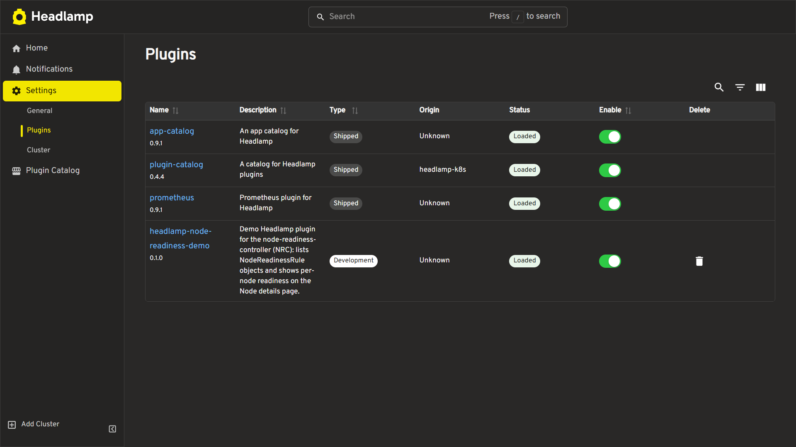
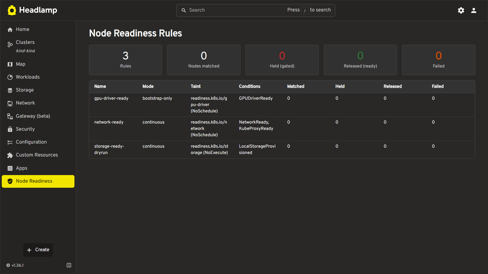
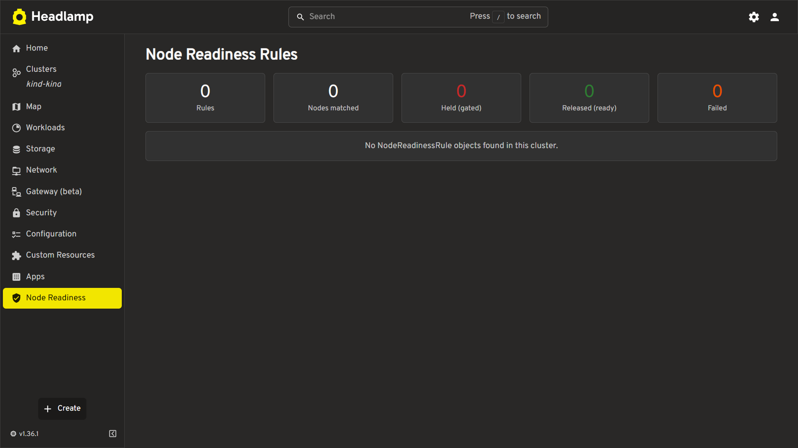

# Headlamp Node Readiness Plugin

A [Headlamp](https://headlamp.dev/) plugin that shows [node-readiness-controller (NRC)](https://github.com/kubernetes-sigs/node-readiness-controller) state directly in the Kubernetes dashboard.

> Built for the CNCF LFX 2026 Term 3 mentorship: [node-readiness-controller#327](https://github.com/kubernetes-sigs/node-readiness-controller/issues/327)

## Features

- Cluster overview with summary stats (rules, matched/held/released nodes)
- Per-node drill-down showing applicable rules and condition status
- Read-only — safely reads API state without making changes
- Works even when NRC isn't installed (shows helpful message)

## Screenshots

**Plugin page (sidebar → Node Readiness)**


**Node details drill-down**


**When NRC isn't installed**


## Getting started

```bash
npm install
npm run start   # Headlamp desktop auto-detects the plugin
```

Then open Headlamp and look for **Node Readiness** in the sidebar.

## Try it with sample data

```bash
kubectl apply -f examples/
```

The rules appear in the sidebar view immediately.
This is an automated update to the README file.
